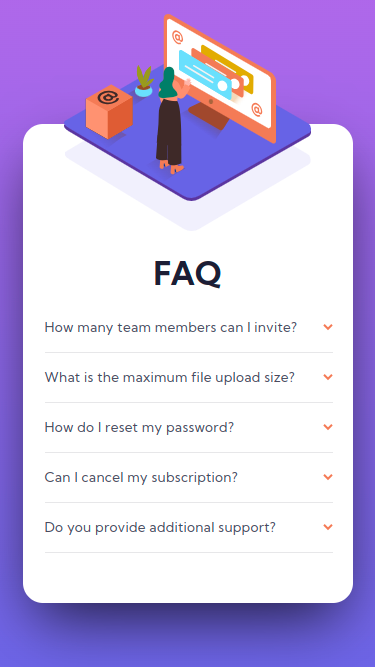

# Frontend Mentor - FAQ accordion card solution

This is a solution to the [FAQ accordion card challenge on Frontend Mentor](https://www.frontendmentor.io/challenges/faq-accordion-card-XlyjD0Oam). Frontend Mentor challenges help you improve your coding skills by building realistic projects.

## Table of contents

- [Overview](#overview)
  - [The challenge](#the-challenge)
  - [Screenshot](#screenshot)
  - [Links](#links)
- [My process](#my-process)
  - [Built with](#built-with)
- [Author](#author)

## Overview

### The challenge

Users should be able to:

- View the optimal layout for the component depending on their device's screen size
- See hover states for all interactive elements on the page
- Hide/Show the answer to a question when the question is clicked

### Screenshot

### Links

- Solution URL: [Solution URL here](https://www.frontendmentor.io/solutions/faq-accordion-card-in-html-css-and-vanilla-javascript-zn-moUM8s4)
- Live Site URL: [Live site URL here](https://harpreet-singh-147.github.io/front-end-mentor-faq-accordion-card-main/)

## My process

### Built with

- Semantic HTML5 markup
- CSS custom properties
- Flexbox
- CSS Grid
- JavaScript

## Author

- Frontend Mentor - [@harpreet-singh-147](https://www.frontendmentor.io/profile/harpreet-singh-147)
- Twitter - [@D147Harpreet](https://twitter.com/D147Harpreet)
